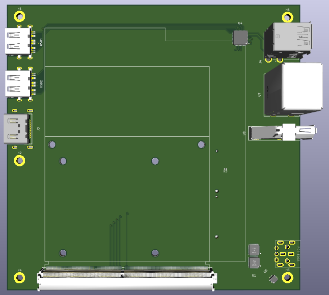

# thundermxm
An open source MXM eGPU board featuring an Intel JHL7440 TB3 controller module, with support for 200W of power. It supports standard MXM3.0A/B cards, as well as Clevo style cards, and supports both TB3 display tunneling and native display output. 

* Very WIP Kicad render

# Specs:
* Intel JHL7440 TB3 module 
* MXM3.0b interface, with full support for Clevo power connectors
* PCIe 3.0 x4 link
* All available I/O broken out:
    * 3x DP + 1x HDMI for monitor and VR headset support
    * USB3.0 downstream ports for various devices
* Dell-style 15A barrel jack connector
* Fan header with PWM control (Planned)

## To-do:
* Finalize schematics, now that reference files for the TB3 module have arrived
* Finish routing (waiting on schematic)
 

This project wouldn't exist without the help of [wifi](https://github.com/a-little-wifi/) and her incredible [MXM Immobilizer project](https://github.com/a-little-wifi/mxm-immobilizer). I also stole the cool MXM outline from there :3
